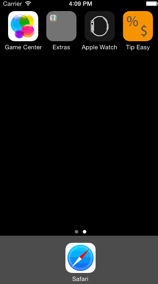

# Tip-Calculator
PreWork4CodePath 

This is the pre-work assignment for CodePath design class

Time spent: 9 hours

Completed user stories:
* [x] Required: User can enter a bill amount and receive the tip amount and the total amount of payment
* [x] Required: User can select from 3 different percentages of tip amount, 18%, 20% and 22%
* [x] Optional: User can change the number of party in the group and receive the total payment amount per person
* [x] Optional: User can click on the App icon image to launch the Tip Easy app
* [ ] Optional: When there is more than 1 person in the group, user can click on Reqeust money and select friends from their contact list (hasnt completed the address book part)

Notes:
Ran into this SIGABRT crash error and it took me some time to figure out how to fix it.

Walkthrough of user stories:

